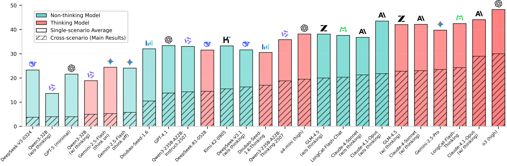

<div align=center><h1>
    🌱VitaBench: Benchmarking LLM Agents<br>
    with Versatile Interactive Tasks
</h1></div>

<p align="center">
  📃 <a href="https://arxiv.org/abs/2509.26490" target="_blank">Paper</a > • 🌐 <a href="https://vitabench.github.io/" target="_blank">Website</a > • 🏆 <a href="https://vitabench.github.io/#Leaderboard" target="_blank">Leaderboard</a > • 🤗 <a href="https://huggingface.co/datasets/meituan-longcat/VitaBench" target="_blank">Dataset</a ><br>
</p >

## 🔔 News

- [2026-01] An updated version of our benchmark is released with rectified datasets and tools, upgraded evaluation models, and updated metrics for proprietary and open language models based on the new evaluator.
- [2025-11] The English version of the VitaBench dataset is now released! It includes fully translated tasks and databases, enabling broader international use. Try it out!
- [2025-10] Our paper is released on arXiv: [VitaBench: Benchmarking LLM Agents with Versatile Interactive Tasks in Real-world Applications](https://arxiv.org/abs/2509.26490)
- [2025-10] The VitaBench suite is released, including the **codebase, dataset and evaluation pipeline**! If you have any questions, feel free to raise issues and/or submit pull requests for new features of bug fixes.

## 📖 Introduction

In this paper, we introduce **VitaBench**, a challenging benchmark that evaluates agents on **v**ersatile **i**nteractive **ta**sks grounded in real-world settings. Drawing from daily applications in food delivery, in-store consumption, and online travel services, VitaBench presents agents with the most complex life-serving simulation environment to date, comprising **66 tools**. Through a framework that eliminates domain-specific policies, we enable flexible composition of these scenarios and tools, yielding **100 cross-scenario tasks (main results) and 300 single-scenario tasks**. Each task is derived from multiple real user requests and requires agents to reason across temporal and spatial dimensions, utilize complex tool sets, proactively clarify ambiguous instructions, and track shifting user intent throughout multi-turn conversations. 

Moreover, we propose a rubric-based sliding window evaluator, enabling robust assessment of diverse solution pathways in complex environments and stochastic interactions. Our comprehensive evaluation reveals that even the most advanced models achieve only 32.5% success rate on cross-scenario tasks, and less than 62% success rate on others. Overall, we believe VitaBench will serve as a valuable resource for advancing the development of AI agents in practical real-world applications.

> *The name “Vita” derives from the Latin word for “Life”, reflecting our focus on life-serving applications.*



## 🌱 Benchmark Details

VitaBench provides an evaluation framework that supports model evaluations on both single-domain and cross-domain tasks through flexible configuration. For cross-domain evaluation, simply connect multiple domain names with commas—this will automatically merge the environments of the specified domains into a unified environment.

Statistics of databases and environments:

|                                | Cross-Scenarios<br>(All domains) | Delivery | In-store |  OTA  |
| :----------------------------- | :-------------: | :------: | :------: | :---: |
| **Databases**                  |                 |          |          |       |
| &nbsp;&nbsp; Service Providers |      1,324      |   409    |   611    | 1,437 |
| &nbsp;&nbsp; Products          |      6,942      |   784    |  3,277   | 9,693 |
| &nbsp;&nbsp; Transactions      |       334       |    48    |    36    |  154  |
| **API Tools**                  |                 |          |          |       |
| &nbsp;&nbsp; Write             |       27        |    4     |    9     |  14   |
| &nbsp;&nbsp; Read              |       33        |    10    |    10    |  19   |
| &nbsp;&nbsp; General           |        6        |    6     |    5     |   5   |
| **Tasks**                      |       100       |   100    |   100    |  100  |


## 🛠️ Quick Start

### Installation

1. Clone the repository:
```bash
git clone https://github.com/meituan-longcat/vitabench.git
cd vitabench
```

2. Install Vita-Bench

```bash
pip install -e .
```

This will enable you to run the `vita` command.


### Setup LLM Configurations

If you want to customize the location of the `models.yaml` file, you can specify the environment variable `VITA_MODEL_CONFIG_PATH` (default path from repository root is `src/vita/models.yaml`). For example:

```bash
export VITA_MODEL_CONFIG_PATH=/path/to/your/model/configuration
```

Example `models.yaml` file

```yaml
default:
  base_url: <base url>
  temperature: <temperature>
  max_input_tokens: <max input tokens>
  headers:
    Accept: "*/*"
    Accept-Encoding: "gzip, deflate, br"
    Content-Type: "application/json"
    Authorization: "Bearer <api key>"
    Connection: "keep-alive"
    Cookie: <cookie>
    User-Agent: <user agent>

models:
  - name: <model name>
    max_tokens: <max completion tokens (for some models, use max_completion_tokens)>
    max_input_tokens: <max input tokens>
    reasoning_effort: "high"
    thinking: 
      type: "enabled"
      budget_tokens: <budget tokens>
    cost_1m_token_dollar:
      prompt_price: <dollars per 1 million tokens>
      completion_price: <dollars per 1 million tokens>
```
The default configuration can apply to all models, the custom model configuration can overwrite default values.

### Run evaluations

To run a test evaluation:

```bash
vita run \
  --domain <domain> \              # support single domain (delivery/instore/ota) and cross domain ([delivery,instore,ota])
  --user-llm <model name> \        # model name in models.yaml
  --agent-llm <model name> \       # model name in models.yaml
  --enable-think \                 # Enable think mode for the agent. Default is False.
  --evaluator-llm <model name> \   # The LLM to use for evaluation.
  --num-trials 1 \                 # (Optional) The number of times each task is run. Default is 1.
  --num-tasks 1 \                  # (Optional) The number of tasks to run. Default is the number of all tasks.
  --task-ids 1 \                   # (Optional) Run only the tasks with the given IDs. Default is run all tasks.
  --max-steps 300 \                # (Optional) The maximum number of steps to run the simulation. Default is 300.
  --max-concurrency 1 \            # (Optional) The maximum number of concurrent simulations to run. Default is 1.
  --csv-output <csv path> \        # (Optional) Path to CSV file to append results.
  --language <chinese/english> \   # (Optional) The language to use for prompts and tasks. Choices: chinese, english. Default is chinese.
```

Results will be saved in `data/simulations/`.

### Re-evaluation simulation

Re-evaluate the simulation instead of running new ones.
```bash
vita run \
  --re-evaluate-file <simulation file path> \
  --evaluation-type <evaluation type> \
  --evaluator-llm <evaluation model> \
  --save-to <new simulation file path>
```

### Viewing Results
```bash
vita view \
--file <simulation file path> # If provided, only view the given simulation
```


## 🔎 Citation

If you find our work helpful or relevant to your research, please kindly cite our paper:

```
@article{he2025vitabench,
      title={VitaBench: Benchmarking LLM Agents with Versatile Interactive Tasks in Real-world Applications}, 
      author={He, Wei and Sun, Yueqing and Hao, Hongyan and Hao, Xueyuan and Xia, Zhikang and Gu, Qi and Han, Chengcheng and Zhao, Dengchang and Su, Hui and Zhang, Kefeng and Gao, Man and Su, Xi and Cai, Xiaodong and Cai, Xunliang and Yang, Yu and Zhao, Yunke},
      journal={arXiv preprint arXiv:2509.26490},
      year={2025}
}
```

## 🤗 Acknowledgement

We adapted part of the [tau2-bench](https://github.com/sierra-research/tau2-bench)'s codebase in building our evaluation framework, and we greatly appreciate their contributions to the agent community.

## 📜 License

This project is licensed under the MIT License - see the [LICENSE](./LICENSE) file for details.

## 📪 Support

For questions and support, please open an issue on GitHub or contact the maintainers.
